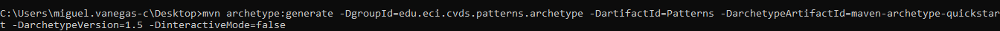
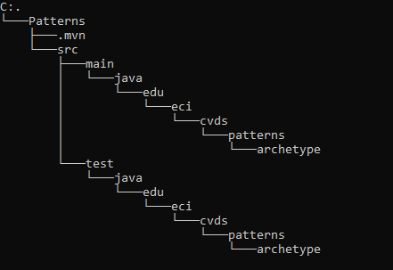
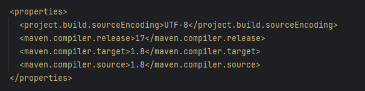
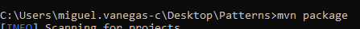
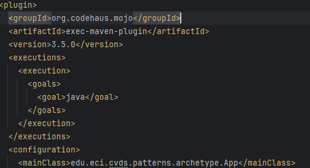
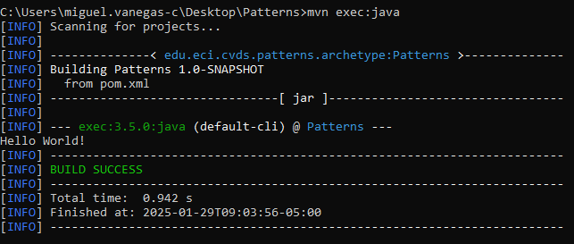
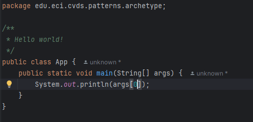
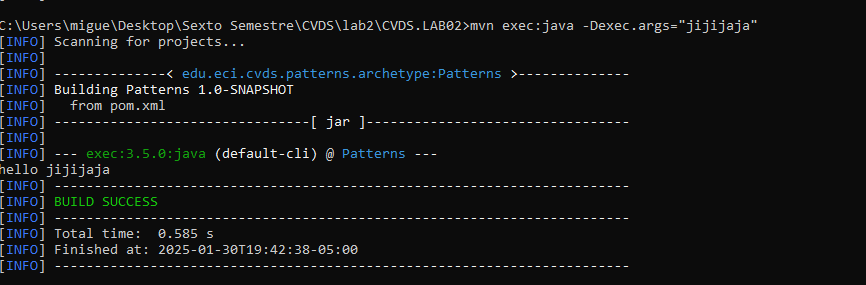
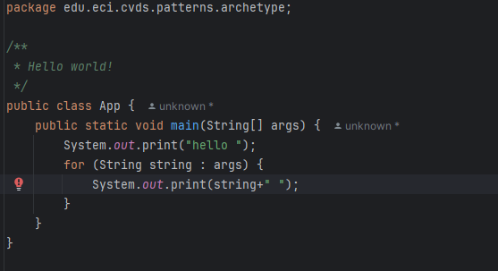
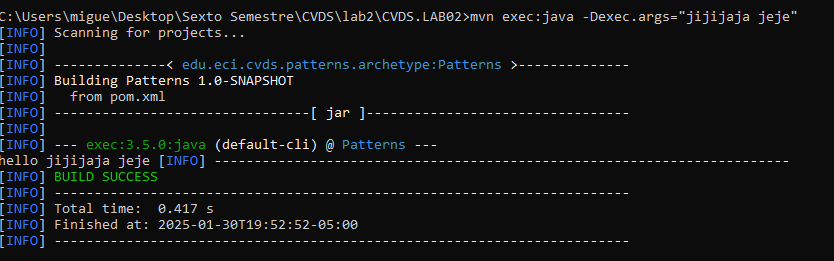

#### TALLER 2
#### NICOLAS ANDRES DUARTE RODRIGUEZ
#### MIGUEL ANGEL VANEGAS CARDENAS
##### PATTERNS - FACTORY

## PRE-RREQUISITOS
- Java OpenJDK Runtime Environment: 17.x.x
- Apache Maven: 3.9.x

## OBJETIVOS
1. Entender ¿qué es Maven?
2. Usar comandos de generación de arquetipos, compilación y ejecución de un proyecto usando Maven
3. Obtener puntos adicionales por PR qué corrijan o mejoren los laboratorios

## LA HERRAMIENTA MAVEN
La herramienta [Apache Maven](https://maven.apache.org/what-is-maven.html) se usa para gestionar y manejar proyectos de software. La base de maven para un proyecto es el concepto de un modelo de objeto de proyecto (POM), Maven puede gestionar la compilación, los informes y la documentación de un proyecto a partir de este modelo, que se concreta en el archivo `pom.xml`.

Ingresar a la página de la herramienta y entender:
- Cuál es su mayor utilidad
- Fases de maven
- Ciclo de vida de la construcción
- Para qué sirven los plugins
- Qué es y para qué sirve el repositorio central de maven

## EJERCICIO DE LAS FIGURAS
### CREAR UN PROYECTO CON MAVEN
Buscar cómo se crea un proyecto maven con ayuda de los arquetipos (archetypes).

Se uso la siguiente configuracion para crearlo:
```yml
ProjectId: org.apache.maven.archetypes:maven-archetype-quickstart:1.0
Id del Grupo: edu.eci.cvds
Id del Artefacto: Patterns
Paquete: edu.eci.cvds.patterns.archetype
```
Siguiendo dicha configuracion se creo el proyecto de la siguiente forma:



La estructura del proyecto recien creado es el siguiente es el siguiente:



Que es exactamente la misma del documento del laboratorio:
```sh
.
│ pom.xml
└───src
├───main
│ └───java
│ └───edu
│ └───eci
│ └───cvds
│ └───patterns
  └───archetype
│ App.java
│
└───test
└───java
└───edu
└───eci
└───cvds
└───patterns
└───archetype
AppTest.java
```

## AJUSTAR ALGUNAS CONFIGURACIONES EN EL PROYECTO
Edite el archivo `pom.xml` y realize la siguiente actualización:

Hay que cambiar la version del compilador de Java a la versión 8, para ello, agregue la sección `properties` antes de la sección de
dependencias:
```xml
<properties>
  <maven.compiler.target>1.8</maven.compiler.target>
  <maven.compiler.source>1.8</maven.compiler.source>
</properties>
```
Se agregó de la siguiente forma:



## COMPILAR Y EJECUTAR
Para compilar ejecute el comando:
```sh
$ mvn package
```
Se hizo del comando package para compilar el proyecto:



Para ejecutarlo primero se hicieron algunos ajustes en el pom.xml:
Se especificó la ruta del main de la siguiente forma:



De esta manera se redujo conciderablemente el comando de ejecucion, el comando es el siguiente:
```cmd
mvn exec:java
```
La ejecucion se muestra en la siguiente imagen:



Para realizar el cambio del mensaje, primero se modificó él .java de la siguiente forma:



Ahora probamos la ejecucion con un mensaje personalizado:



Para que el mensaje tenga más de una palabra es necesario modificar él .java de la siguiente forma:



Ahora probamos la ejecucion con un mensaje personalizado:



## HACER EL ESQUELETO DE LA APLICACIÓN
Cree el paquete `edu.eci.cvds.patterns.shapes` y el paquete `edu.eci.cvds.patterns.shapes.concrete`.

Cree una interfaz llamada `Shape.java` en el directorio `src/main/java/edu/eci/cvds/patterns/shapes` de la siguiente manera:
```java
package edu.eci.cvds.patterns.shapes;

public interface Shape {
    public int getNumberOfEdges();
}
```

Cree una enumeración llamada `RegularShapeType.java` en el directorio `src/main/java/edu/eci/cvds/patterns/shapes` así:

```java
package edu.eci.cvds.patterns.shapes;

public enum RegularShapeType {
    Triangle, Quadrilateral, Pentagon, Hexagon
}
```

En el directorio `src/main/java/edu/eci/cvds/patterns/shapes/concrete` cree las diferentes clases (Triangle, Quadrilateral, Pentagon, Hexagon), que implementen la interfaz creada y retornen el número correspondiente de vértices que tiene la figura. 

Siguiendo el ejemplo del triángulo:
```java
package edu.eci.cvds.patterns.shapes.concrete;

import edu.eci.cvds.patterns.shapes.Shape;

public class Triangle implements Shape {
    public int getNumberOfEdges() {
        return 3;
    }
}
```

Cree el archivo `ShapeMain.java` en el directorio `src/main/java/edu/eci/cvds/patterns/shapes` con el metodo main:
```java
package edu.eci.cvds.patterns.shapes;

public class ShapeMain {

  public static void main(String[] args) {
    if (args == null || args.length != 1) {
      System.err.println("Parameter of type RegularShapeType is required.");
      return;
    }
    try {
      RegularShapeType type = RegularShapeType.valueOf(args[0]);
      Shape shape = ShapeFactory.create(type);
      System.out.println(
        String.format(
          "Successfully created a %s with %s sides.",
          type,
          shape.getNumberOfEdges()
        )
      );
    } catch (IllegalArgumentException ex) {
      System.err.println(
        "Parameter '" + args[0] + "' is not a valid RegularShapeType"
      );
      return;
    }
  }
}
```

Analice y asegúrese de entender cada una de las instrucciones que se encuentran en todas las clases que se crearon anteriormente. Cree el archivo `ShapeFactory.java` en el directorio `src/main/java/edu/eci/cvds/patterns/shapes` implementando el patrón fábrica (Hint: https://refactoring.guru/design-patterns/catalog), haciendo uso de la instrucción switch-case de Java y usando las enumeraciones.

¿Cuál fábrica hiciste? y ¿Cuál es mejor?
- Simple Factory:


- Factory Method:


- Abstract Factory:


Ejecute múltiples veces la clase ShapeMain, usando el plugin exec de maven con los siguientes parámetros y verifique la salida en consola para cada una:
- Sin parámetros
- Parámetro: qwerty
- Parámetro: pentagon
- Parámetro: Hexagon

¿Cuál(es) de las anteriores instrucciones se ejecutan y funcionan correctamente y por qué?

## ENTREGAR
- Se espera al menos que durante la sesión de laboratorio, se termine el ejercicio del saludo y haya un avance significativo del ejercicio de las figuras.
Dentro del directorio del proyecto, cree un archivo de texto integrantes.txt con el nombre de los dos integrantes del taller.
- Crear un repositorio para este proyecto y agregar la url del mismo, como entrega del laboratorio.
- La entrega final se realizará en Moodle.
- NOTA: Investigue para qué sirve "gitignore" y configurelo en su proyecto para evitar adjuntar archivos que no son relevantes para el proyecto.

<!-- https://docs.github.com/en/get-started/writing-on-github/getting-started-with-writing-and-formatting-on-github/basic-writing-and-formatting-syntax -->